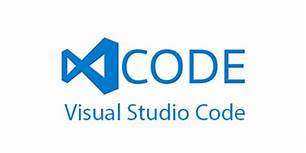

# <em>Weekly Exercises: Programming & Scripting - 52167</em>
## Overview
A repository containing completed exercises for college subject 'Programming and Scripting' at GMIT.
The files that are included within this repository have been uploaded for the purpose of being scored as apart of my Continuous Assessment for this subject.  
I have created a table (see below) explaining which topic each file is linked to as per exercises set out on the course <a href="https://learnonline.gmit.ie/course/view.php?id=3940">Moodle Page</a>.

WEEKLY TASKS |  TOPIC AREA
------------ | -------------
Exercise 1 & 2 | Fibonacci & Surname
Exercise 3 | Collatz Script
Exercise 4 | Project Euler Problem 5
Exercise 5 | Iris Data Set
Exercise 6 | Factorial Function

   

Please follow the below steps to download the software which I used to create these files:
- [x] Download <a href="https://code.visualstudio.com/Download">Visual Studio Code</a>
- [x] Download <a href="https://www.anaconda.com/download/">Anaconda</a> {Ensure to select the newest version of Anaconda, which is Python 3.6 version at the time of publishing.}   
<em>Python itself is a programming language, there are many pieces of software which can be used to access it. For this repository, I have chosen to use Anaconda as instructed by the course lecturer. Please note: the download file is a large file, >500MB.</em>  
- [x] Once downloaded, run both the exe files and follow to step-by-step guide to complete install.
- [x] Copy and paste the file content into Visual Studio Code
- [x] Open the Integrated Terminal and to run the file type <strong>python filename.py</strong>

## Fibonacci & Surname
<strong>Topic 1: Basics of Programming</strong>  
<strong>Topic 2: State, variables and statements</strong>  
<em>Completed exercises for weeks 1 & 2, including my comment from the Discussion Forum for these tasks.</em>

## Collatz Script
<strong>Topic 3: Conditions, loops and flow control</strong>  
<em>Write a single Python script that starts with an integer and repeatedly applies the Collatz function (divide by 2 if even, multiply by three and 1 if odd) using a while loop and if statement. </em>

## Project Euler Problem 5
<strong>Topic 4: Lists</strong>   
<em>Write a Python program using for and range to calculate the smallest positive number that is evenly divisible by all of the numbers from 1 to 20.</em>

## Iris Data Set
<strong>Topic 5: Input and output</strong>  
<em>Write a Python script that reads the Iris data set in and prints the four numerical values on each row in a nice format.</em> 

## Factorial Function
<strong>Topic 6: Functions</strong>  
<em> Write a Python script containing a function called factorial() that takes a single input/argument which is a positive integer and returns its factorial. You should, in your script, test the function by calling it with the values 5, 7, and 10.</em>

## 
References:

<ul>
<li>Visual Studio Code download - https://code.visualstudio.com/Download</li>
<li>Anaconda download - https://www.anaconda.com/download/</li>
<li><em>'Iris Flower Data Set'</em> Wikipedia Page - https://en.wikipedia.org/wiki/Iris_flower_data_set</li>
<li>'Iris Flower Data Set' download file - http://archive.ics.uci.edu/ml/machine-learning-databases/iris/</li>
<li>Mastering Markdown - https://guides.github.com/features/mastering-markdown/</li>
<li>Markdown Wikipedia Page - https://en.wikipedia.org/wiki/Markdown</li>
</ul>
